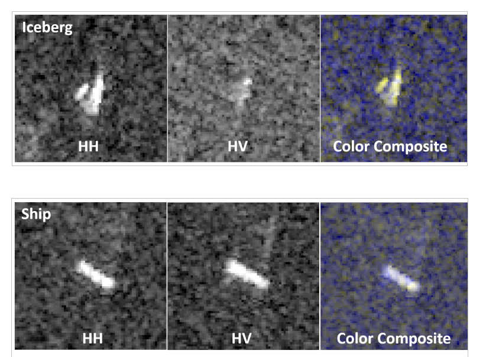

# Machine Learning Engineer Nanodegree
## Capstone Proposal
Mehdi Khodayari

_November 6th, 2017_

## Proposal
In this project a labeled dataset (set of images collected from the Sentinel-1 satellite and labeled manually) is used to train a binary classification model which can predict if there is iceberg(s) in new observations or not.

### Domain Background
The Sentinel-1 satellite sends a signal to an object and collect the echo referred to as backscatter which is then converted to an image. The backscatters from any solid objects such as ship, iceberg, and land is stronger than that from water, making it possible to distinguish between solid objects and water. In fact, solid objects in the resultant images appear brighter than their surrounding (water).
The emitted signals from the satellite always hit the objects horizontally, but the backscatters are received either horizontally or vertically. Hence, two sets of information (images) are obtained from objects; the first set, here referred to as HH (transmit/receive horizontally), corresponds to the horizontal backscatters and the second set, referred to as HV (transmit horizontally and receive vertically), corresponds to the vertical backscatters.

### Problem Statement
This is a binary classification project and the challenge is to predict the label of every image as 1 (if there is iceberg(s) in the image) or 0 (if the detected objects corresponds only to Ship(s)).

### Datasets and Inputs
This project is an ongoing [kaggle competition](https://www.kaggle.com/c/statoil-iceberg-classifier-challenge#background) (at the time of this proposal submission) and the data is given in json format. There are train and test datasets. The datasets have the following fields:

  1. id: the image id
  2. band_1, band_2: the flattened image data corresponding to HH and HV respectively each with 5625 elements (75x75 pixels)
  3. inc_angle: the incident angles of which the image was taken
  4. is_iceberg: the train dataset labels which is either 1 (if there is iceberg(s) in the image) or 0 (if the detected objects corresponds only to Ship(s))

The band_1 and band_2 fields have dB unit. The is_iceberg field only exists in the train dataset.

### Solution Statement
In the following images, two samples of the train datasets are shown.

[kaggle competition](https://www.kaggle.com/c/statoil-iceberg-classifier-challenge#Background)

As obvious, the HH images of both iceberg and ship show bright solid objects. However, the HV images differ significantly; the ship HV image shows a bright object as well as its HH image does, but the iceberg HV image hardly shows the presence of a solid object. Here, we try to construct a Convolutional Neural Network (CNN) that can capture this difference.

### Benchmark Model
The following image shows the benchmark CNN model architecture.

### Evaluation Metrics
The training dataset is divided into train and validation datasets and the model accuracy on the validation datasets will be used as the evaluation metric.

### Project Design
First, we try to improve the benchmark model and see if we can achieve better prediction performance by adjusting the layers. Then, bottleneck features of some known CNN architectures such as ResNet-50 and VGG-16 are also extracted and fed into a deep classifier to see how the prediction performance can be improved.
